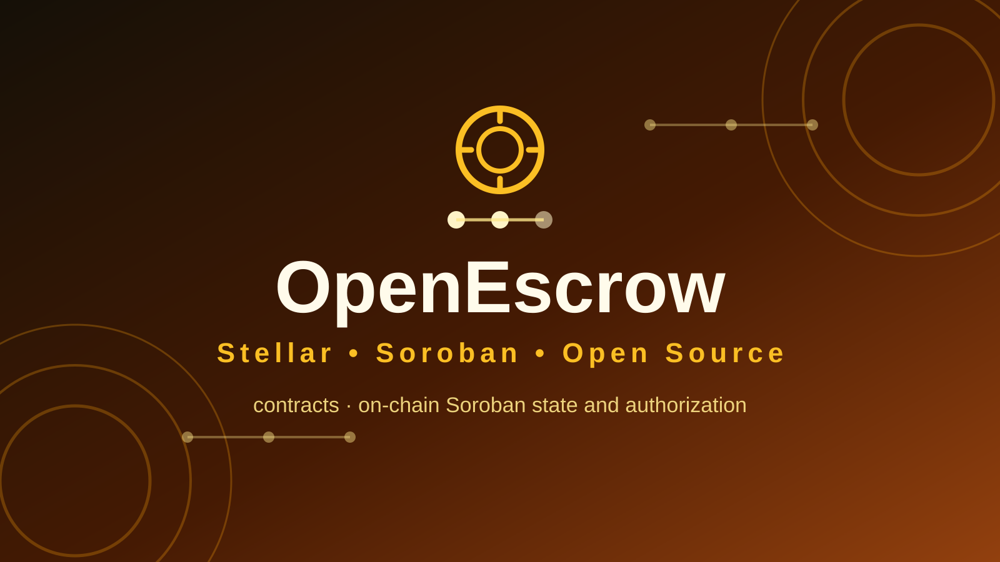
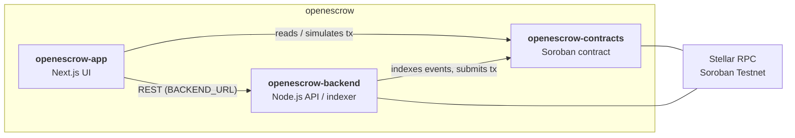

<p align="center">
  
</p>

<h1 align="center">OpenEscrow — openescrow-contracts</h1>

<p align="center"><i>Milestone escrow for services and deliverables.</i></p>

<p align="center">
[](LICENSE)
[](.github/workflows/ci.yml)
[](#tech-stack)
[](#security)
</p>

## Why this exists

Milestone escrow for services and deliverables. This repository is the **on-chain Soroban state and authorization** of the three-repo **OpenEscrow** system.

## Where it fits

- [`openescrow-contracts`](../openescrow-contracts) — on-chain Soroban state and authorization. ← you are here
- [`openescrow-app`](../openescrow-app) — user-facing web application.
- [`openescrow-backend`](../openescrow-backend) — off-chain indexing/API and operational services.



## Features

- Soroban contract crate (`#![no_std]`) with `initialize`, `record`, and `read` entry points
- Address-based authorization on every write (`require_auth`)
- Instance storage for admin and value state
- In-crate test module using `soroban-sdk` testutils
- Size-optimized release profile (`opt-level = "z"`, LTO, overflow checks, panic = abort)
- Makefile workflow: `make test`, `make build`, `make fmt`

## Tech stack

| Layer | Choice |
| --- | --- |
| Language | Rust (edition 2021), `#![no_std]` |
| Framework | `soroban-sdk` 28 (workspace dependency) |
| Build | Cargo workspace + `stellar contract build` (Wasm) |
| Workflow | Makefile (`test`, `build`, `fmt`) |
| Tests | `cargo test` with Soroban testutils |

## Project structure

```text
openescrow-contracts/
├── contracts/openescrow/      # Soroban contract crate
│   ├── Cargo.toml
│   └── src/lib.rs            # contract + tests
├── assets/                   # logo.svg, social-preview.svg
├── docs/ARCHITECTURE.md
├── Cargo.toml                # workspace manifest
├── Makefile                  # test / build / fmt
└── .github/workflows/ci.yml
```

## Getting started

### Prerequisites

- Rust toolchain (`rustup`)
- [Stellar CLI](https://developers.stellar.org/)
- `make`

### Installation

No npm install needed. A Rust toolchain, the [Stellar CLI](https://developers.stellar.org/), and `make` are required.

### Environment variables

No environment variables — builds and tests run fully offline once dependencies are fetched.

### Running locally

Contracts have no long-running process. Build the Wasm with `make build` and deploy it with the Stellar CLI (**not yet scripted here — TODO**).

### Testing

```bash
make test   # cargo test
make fmt    # cargo fmt --all -- --check
```

> ⚠️ **Known issue (pre-existing baseline):** `make test` does not compile yet — the test module calls the removed `env.accounts()` API (needs updating to `Address::generate`, **TODO**), and `make fmt` reports formatting drift. `make build` additionally requires the Stellar CLI, which is not part of this repo.

### Building / deploying

```bash
make build  # stellar contract build (Wasm)
```

## Roadmap

- Replace the baseline `record`/`read` storage with real milestone creation, funding and release flows
- Events for off-chain indexing
- Deploy + upgrade runbook scripted in the Makefile
- External audit before any mainnet value

## Contributing

See [CONTRIBUTING.md](CONTRIBUTING.md) and [CODE_OF_CONDUCT.md](CODE_OF_CONDUCT.md).

## Security

See [SECURITY.md](SECURITY.md) for reporting guidelines.

> **Status: v0.1.0 — not audited, not production-ready.** Do not deploy with real funds.

## Maintainer

**Hikmaholadele** ([@Hikmaholadele](https://github.com/Hikmaholadele))

## License

Licensed under the [Apache License 2.0](LICENSE).
